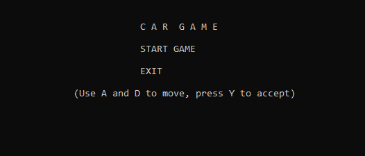
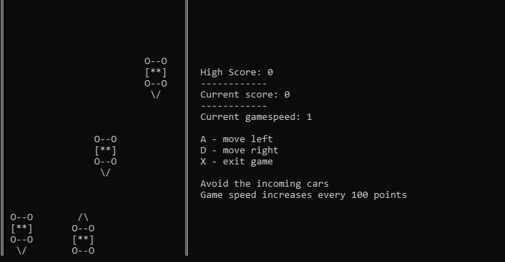
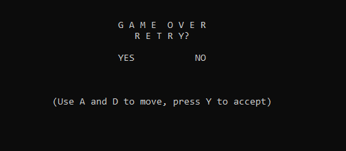

# Car-Game

## General info

A C++ console game where the player must avoide incoming cars. ASCII characters were used for the graphics.

## Table of Contents

- [General info](#general-info)
- [Features](#features)
- [Screenshots](#screenshots)
- [Tech stack](#tech-stack)
- [Authors](#authors)

## Features

<li>Move the car(player) using A and D keys.

<li>High score is increased with each passed car.

<li>Every 100 points, the game speed increases.

</li>

  

## Screenshots

## Tech stack

* C++

## Authors

| Name          | Github                                   |
|---------------|------------------------------------------|
| Jakov Soldić  | [GitHub](https://github.com/JakovSoldic) |

